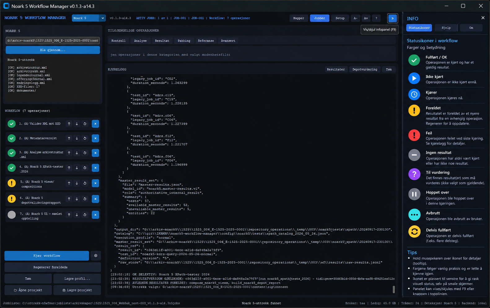

# Workflow-status og infopanel

## Formål

Fra v0.1.3-a14.3 har hver operasjon i workflowen ett kompakt statusikon til venstre. Ikonet er en flerbruksindikator som gjør status lesbar uten å gjøre workflow-radene høyere. Det skal fungere også på laptop og smalere vinduer.

Høyre **INFO**-panel er en generell informasjonsflate. Panelet kan vises/skjules med knappen i topplinjen eller **F9**. Det er skjult som standard slik at midtfeltet beholder maksimal bredde på mindre skjermer. Synlig/skjult tilstand huskes.

Bildet er en designreferanse for struktur og semantikk, ikke en pikselkontrakt. Implementasjonen skal følge tema, fontskalering og eksisterende responsiv vinduslogikk.

## Statusikon

Status bestemmes med stabil `operation_id`. Nummeret i workflowen er bare aktuell visuell rekkefølge og skal ikke brukes som varig identitet.

| Status | Farge | Symbol | Betydning |
|---|---|---|---|
| Fullført / OK | grønn | ✓ | Operasjonen er fullført og resultatet er gjeldende. |
| Ingen resultat | grå | – | Operasjonen er ikke kjørt eller har ikke resultat ennå. |
| Kjører | blå | ◷ | Operasjonen kjøres nå. |
| Foreldet | oransje | ! | Resultatet er teknisk fullført, men et nyere upstream-resultat gjør det avledede resultatet foreldet. |
| Feil | rød | ! | Operasjonen feilet ved siste relevante kjøring. |
| Til vurdering | lilla | ? | Resultat finnes, men må vurderes før det eventuelt blir gjeldende. |
| Hoppet over | grå | Ⅱ | Operasjonen ble hoppet over. |
| Avbrutt | turkis | … | Operasjonen/kjøringen ble avbrutt. |
| Delvis fullført | gul | ↻ | Operasjonen er delvis fullført eller venter på videre behandling. |

**Prioritet:** `Foreldet` skal overstyre `Fullført / OK`. En avledet operasjon skal altså aldri se grønn ut når den er invalidert av et nyere gjeldende upstream-resultat. `Feil` er rød; `Foreldet` er oransje.

Hold musen over statusikonet for forklaring. Tooltipen følger den eksisterende livssyklusregelen og skal ikke bli liggende som et topmost-overlay.

## INFO-panelet

Panelet har i a14.3 tre faner:

- **Statusikoner** – forklarer farger, symboler og betydning.
- **Hjelp** – kort kontekstuell brukerveiledning.
- **Om** – versjon og arkitekturprinsipp.

Panelet er laget som en generell høyreflate slik at senere versjoner kan vise jobbstatus, resultatversjoner, vurderinger, avhengigheter eller annen kontekst uten å legge permanent informasjon inn i hovedarbeidsflaten.

## Foreldede resultater

Når et nytt gjeldende resultat invaliderer avledede operasjoner:

1. operasjonen får oransje statusikon `Foreldet`,
2. `Regenerer foreldede` blir aktiv,
3. regenerering skjer bare for aktuelle foreldede operasjoner i workflow-rekkefølge,
4. historikken er append-only; gamle invalidasjonshendelser og resultatfiler slettes ikke,
5. vellykket regenerering registreres som ny historikkhendelse og statusikonet går tilbake til gjeldende status.

## a14.4 – resultatversjoner fra statusikonet

Statusikonet er også inngangen til historikken for den stabile `operation_id`-en. Klikk på ikonet for å åpne en skrivebeskyttet oversikt over alle lagrede resultatversjoner for operasjonen.

Visningen viser blant annet:

- tidspunkt for kjøringen
- PASS/FAIL
- definisjonsversjon
- `result_id`
- siste vurderingsstatus (`accepted`, `superseded`, `requires_review` osv.)
- hvilken versjon som er gjeldende

Historikken er append-only. a14.4 endrer ikke gjeldende resultat fra denne dialogen; endring av gjeldende versjon uten ny kjøring er et senere steg.
